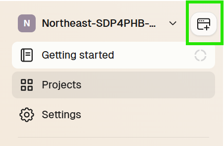
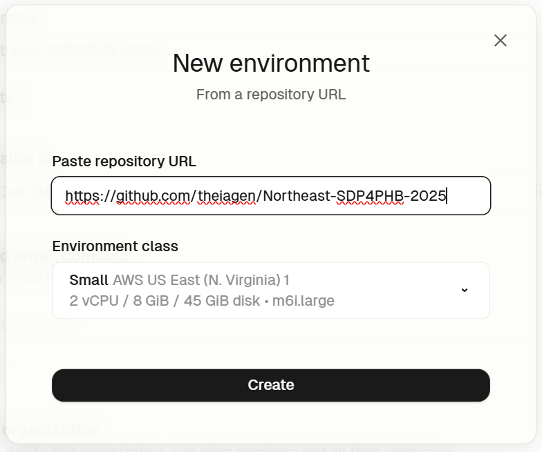

# Software Development Practices for Public Health Bioinformatics
A Northeastern Bioinformatics Regional Resource Offering Provided by the Massachusetts Department of Public Health in Collaboration with Theiagen Genomics

## Content
- [Overview](#overview) 
  - [Training Objectives](#training-objectives)
  - [Target Audience](#target-audience)
  - [Course Format](#course-format)
- [Course Content](#course-content)
- [Prerequisites for Hands-On Exercises](#prerequisites-for-hands-on-exercises)

## Overview 
The  Massachusetts Department of Public Health, in collaboration with Theiagen Genomics, will be hosting a Software Development Practices for Public Health Bioinformatics Course. This will be a virtual workshop hosted on Mondays and Wednesdays via Zoom from **February 24th - March 19st, 2025**. All training materials will be hosted on this GitHub page to encourage self-paced and asynchronous learning. 

### Training Objectives
- Knowledge of best software development practices applied to public health bioinformatics such as design documents and the use of integrated development environments 
- Proficiency in using version control systems for collaborative development
- Ability to deploy continuous integration and acceptance testing
- Understanding workflow managers and how to construct an analysis pipeline

### Target Audience
This course is designed for bioinformatics scientists interested in strengthening their skill sets as pipeline developers. We aim to cover a comprehensive range of topics, from foundational concepts to advanced techniques, ensuring you gain the knowledge and tools needed to excel in your field. 

Participants should have a strong background in bioinformatics, specifically accessing open-source tools through a command-line interface, running bioinformatics pipelines, and proficiency in at least one scripting language (e.g. Python, Perl, or BASH).  Participants should also have a [GitHub account](https://github.com/signup) (or an ability to create one) and [Visual Studio Code](https://code.visualstudio.com) installed in their system. This training is most beneficial for those with access to a Linux environment within their host institution.

### Course Format 
This will be a 4-week training series occurring on Monday and Wednesday from February 24th - March 19st, 2025: 
- Monday (90 min): Lecture material with hands-on exercises
- Wednesday (60 min): "Office hours" style meeting where participants can ask any questions about the material, and the trainers will address any errors encountered by participants.

All lecture content will be recorded and made available through this GitHub repository to facilitate self-paced and asynchronous learning.

## Course Content

### Slides & Exercises
**Week 00: Training Kick-Off**
- [Lecture Slides](./slides/Week%200%20-%20Northeast%20WFD%20Training%20Workshop_%20Training%20Kick%20Off.pdf)
- [Recording](https://youtu.be/hqO78lw-4Rg)

**Week 01: Design Documents & Development Environments**
- [Lecture Slides](./slides/Week%200%20-%20Northeast%20WFD%20Training%20Workshop_%20Training%20Kick%20Off.pdf)
- [Recording](https://youtu.be/TbpGCh-T6yA)
- [Exercise 01: Design Doc, Dev Environment, and Scripting with VSCode](./exercises/exercise01.md)

**Week 02: Git Fundamentals and Making Source Code Modifications**
- [Lecture Slides](./slides/Week%202%20Lecture%20-%20Northeast%20WFD%20Training%20Workshop_%20Dev%20Practices%20%2B%20Git.pdf)
- [Recording](https://youtu.be/5wrY-Zs1D2Q)
- [Exercise 02: Version Control with Git](./exercises/exercise02.md)

**Week 03: Bringing Changes into Production**
- [Lecture Slides](./slides/Week%203%20Lecture%20-%20Northeast%20WFD%20Training%20Workshop_%20Brining%20Changes%20into%20Production.pdf)
- [Recording](https://youtu.be/MZ9NgxMgFYY)
- [Exercise 03: GitHub Actions & Static Releases](./exercises/exercise03.md)
  
**Week 04: Getting Started with Nextflow**
- [Lecture Slides](./slides/Week%204%20Lecture%20-%20Northeast%20WFD%20Training%20Workshop_%20Workflow%20Managers%20and%20Nextflow.pdf)
- [Recording](https://youtu.be/HabUd75DyCk)
- [Exercise 04: Writing Your First Nextflow Workflow](./exercises/exercise04.md)

## Prerequisites for Hands-On Exercises
In addition to lectures, this course consists of several hands-on exercises to reinforce the coursework material. To participate in these exercises, trainees will need the following resources: 

### GitHub Account
If you don't already have a GitHub account, please go to github.com and register (it's free!). To sign-in to GitHub, please follow the URL at https://github.com/signup
  - Once you have registered, ensure you are signed into your account on https://github.com

### Visual Studio Code
Visual Studio Code, commonly referred to as VS Code, is an Integrated Development Environment (IDE) developed by Microsoft for Windows, Linux, macOS. Features include support for debugging, syntax highlighting, and embedded version control with Git. VS Code supports almost every major programming language. 
- You can download VS Code for your system at https://code.visualstudio.com 

### GitPod Flex Account 
- Navigate to https://app.gitpod.io/
- Select "Continue with GitHub", authorize Gitpod to access your GitHub account, and sign in with your credentials

#### Creating your own organisation
Once your account is connected to GitPod, it will prompt you to create an organization. Unfortunately this step cannot be skipped. You create an organization with whatever name you wish, this will not matter once you are invited to this course's organization. 
  - Note that the organization name will depend on the  cohort and year of the course you are attending, matching this repository name.  

  

#### GitPod Flex Configuration for Public Repositories
Once registered and part of this course's organization, navigate to **Create Environment** button on the top right panel of your screen.

  

  - Create a new environment and connect with the course's repository `https://github.com/theiagen/Northeast-SDP4PHB-2025`.

  

  - You'll be prompted to connect to GitHub via an access token. Select the **Developer Settings** URL and follow the configuration process on GitHub.

  

  

  - Paste the Personal Access token on the required field and click **Connect**. 

#### GitPod Workspace
  - Once your workspace is running, select **Open with VS Code**

  

  - VS Code will open and you'll be prompted to install GitPod Extension and connect to your new environment. Click **"Install Extension and Open URI"**

  

 
 

  

🚨**NOTE**🚨 Once you're finished working, make sure to shut down your workspace in GitPod. There are a few ways to stop your workspace from running! It will auto-stop after 30 minutes of inactivity to save resources but you can force it to stop by clicking on the **toggle next to the status information**. 
