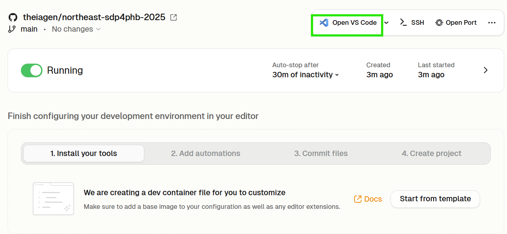
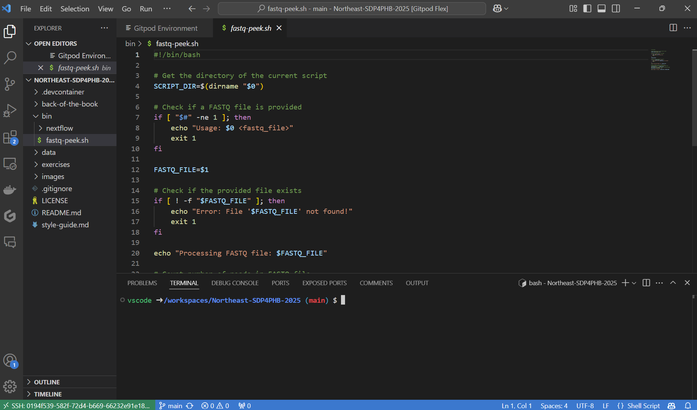

# Exercise 01: Design Doc, Dev Environment, and Scripting with VSCode

1. Assess our [Design Doc](./design-doc.md) to gain an thorough understanding of our project's **Problem Statement**, **Objectives**, **Proposed Solution**, and **Implementation Plan**.

2. Use GitPod Flex to create a dev environment:
    - Navigate to https://app.gitpod.io/
    - Select "Continue with GitHub", authorize Gitpod to access your GitHub account, and sign in with your credentials
    - In the `<COHORT>`-SDP4PHB-`<YEAR>` organization, create a new environment
    - Set the repository to https://github.com/theiagen/`<COHORT>`-SDP4PHB-`<YEAR>`/
    - Click on the "Open with VS Code" button
  

  

  

  

3. Familiarize yourself with the VSCode environment

  

4. Assess the [fastq-peek.sh](../bin/fastq-peek.sh) software and test it using the [benchmark read data](../data/sample.fastq):
   `./bin/fastq-peek.sh ./data/sample.fastq`

  

5. Begin modifying [fastq-peek.sh](https://github.com/theiagen/Western-WFD-2024/blob/main/bin/fastq-peek.sh) to calculate `GC_COUNT`, `TOTAL_BASE_COUNT`, & `GC_PERCENT`; report `GC_PERCENT` to `stdout`
    - Test your solutions using the [benchmark read data](https://github.com/theiagen/Western-WFD-2024/blob/main/data/sample.fastq)
      - Calculated GC Content for this input fastq file should equal 50%
    - Be sure to adhere to the [repository style guide](https://github.com/theiagen/Western-WFD-2024/blob/main/style-guide.md) when modifying [fastq-peek.sh](https://github.com/theiagen/Western-WFD-2024/blob/main/bin/fastq-peek.sh)

7. Save your changes within your workspace

8. Once you're finished working, make sure to shut down your workspace. Click on the toggle next to "Running", either on VS Code or on Gitpod Flex platform, to turn everything off.

  

 
 Exercise 1 Solution
 
 

A modified fastq-peek.sh code with gc-count calculation and reporting can be found in the [back of the book](../back-of-the-book/fastq-peek-gc.sh).

