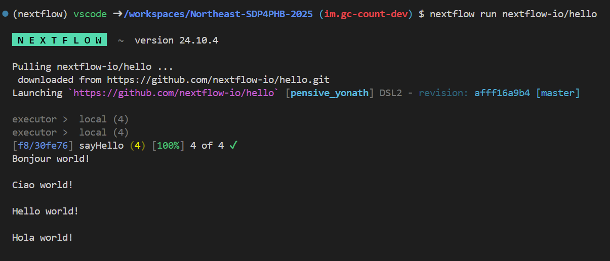

# Exercise 04: Writing Your First Nextflow Workflow

In this exercise, you will wrap the `fastq-peek.sh` script developed in [Exercise 02](./exercise02.md) and [Exercise 03](./exercise03.md) into a Nextflow workflow. We'll be getting an introduction into [Nextflow](https://www.nextflow.io/) (with a few sprinkles of [Conda](https://conda.io/) and [Docker](https://www.docker.com/) thrown in). 


## Installing Nextflow in Your System

### Conda

When installing the [Conda](https://conda.io/) package manager you have two options, [Anaconda](https://www.anaconda.com/products/distribution) or [Miniconda](https://conda.io/miniconda.html). Anaconda comes with a lot of pre-installed packages and Miniconda comes with the bare necessities. For our purposes, we'll be using Miniconda, so lets get it installed.

First things first, let's get Miniconda installed. _A link is used in the below code_, but for 
future reference you can always get links to the available
[Miniconda - Installers](https://docs.conda.io/en/latest/miniconda.html#latest-miniconda-installer-links).
Today, since we are on a Linux VM, we will be installing the `Miniconda3 Linux 64-bit` version. 

```{bash}
# Download Miniconda installer
wget https://repo.anaconda.com/miniconda/Miniconda3-latest-Linux-x86_64.sh

# Run installer
bash Miniconda3-latest-Linux-x86_64.sh

# >>> In order to continue the installation process, please review the license
# >>> agreement.
# >>> Please, press ENTER to continue
# Press <enter> here to read the license
# 
# >>> ... <LICENSE> ...
# 
# >>> Do you accept the license terms? [yes|no]
# Type 'yes' (without quotes) to accept the license
# >>> ...
# >>>  - Press ENTER to confirm the location
# >>>  - Press CTRL-C to abort the installation
# >>>  - Or specify a different location below
# >>>
# >>> [/home/vscode/miniconda3] >>>
# Press <enter> to install to the default location
# 
# ... Installation and setup will happen ...
# 
# >>> installation finished.
# >>> Do you wish the installer to initialize Miniconda3
# >>> by running conda init? [yes|no]
# Type 'yes' (without quotes) to initialize Miniconda
# 
# >>> Thank you for installing Miniconda3!
source ~/.bashrc
```

If everything was successful, you should now have `(base)` at the start of your command line:

```{bash}
(base) vscode ➜ /workspaces/<COHORT>-SDP4PHB-<YEAR> (main) $  
```

---

#### Conda Rules of Thumb

Its no secret, Conda can be quite sensitive to change. In order to keep Conda happy, try to follow the following rules. By following these, Conda will stay happy, which means you will too!

__Rule Number 1 - Keep `base` clean__  
Keep your base environment clean! Try to avoid installing anything in your `base` environment (_there are a few exceptions!_). If your `base` environment breaks, you have to reinstall Miniconda. 

_There is an exception to this rule of thumb though!_

__Rule Number 2 - Create enviroments__  
`conda create` is your friend, use it for everything! Treat environments as consumables, create them, install in them, delete them.  

__Rule Number 3 - Use containers for critical tasks__
Conda is great, but for critical things its best to use containers (Docker or Singularity). Containers are static and 
once built you know exactly what it contains. When installing packages through Conda dependencies are selected at the
time of installation. Therefore if you install something today, then again in 6 months, you are likely to get different
tool versions.

---

### Nextflow

In this exercise
you will be getting an introduction into [Nextflow](https://www.nextflow.io/). Nextflow is both
a language and workflow manager.

For this exercise the goal is to:

1. Create a `nextflow` environment
2. Execute "Hello World"
3. Write our first Nextflow workflow with `fastq-peek.sh`

### Create a `nextflow` environment

Create an environment for nextflow:

```{bash}
conda create -y -n nextflow -c conda-forge -c bioconda nextflow
conda activate nextflow
nextflow -version

      N E X T F L O W
      version 24.10.3 build 5933
      created 16-12-2024 15:34 UTC (15:34 GMT)
      cite doi:10.1038/nbt.3820
      http://nextflow.io

```

Based on this, Nextflow v22.04.0 was installed in my `nextflow` environment. You can see the release notes at [v24.10.3](https://github.com/nextflow-io/nextflow/releases/tag/v24.10.3).

## Execute "Hello World"

A convenient of Nextflow is that you can provide it an address to a GitHub repo and Nextflow will
execute any existing workflows. Let's give it a try with [nextflow-io/hello](https://github.com/nextflow-io/hello).

```{bash}
nextflow run nextflow-io/hello
```

<p align="center">
  
</p>

And just like that you've just executed a Nextflow pipeline! 

If we take a look at the folder contents you'll have a few new folders and files:
```{bash}
(...)
drwxr-xr-x  4 vscode vscode 4.0K Jan 20 17:53 .nextflow
-rw-r--r--  1 vscode vscode 9.1K Jan 20 17:53 .nextflow.log
(...)
drwxr-xr-x  6 vscode vscode 4.0K Jan 20 17:53 work
```

#### `.nextflow` Folder

The `.nextflow` folder is created by Nextflow to keep Nextflow related files. These files are
really only meant for Nextflow and used for things like caching and locking. I've been using
Nextflow for years and have never had a need to mess with any files in the `.nextflow` folder.

Once you've completed your Nextflow run, it is ok to delete the `.nextflow` folder. But please
keep in mind if you delete it you will no longer be able to resume (`-resume`) previous runs. So,
make sure you are actually done!

#### `.nextflow.log` File

The [.nextflow.log](https://www.nextflow.io/docs/edge/tracing.html#execution-log) contains all
sorts of logging information output by Nextflow. It can be quite
useful to sift through when things aren't working out like you expect them to. In this `.nextflow.log`
file you can see which [config files were loaded](https://www.nextflow.io/docs/edge/config.html)
and in what order, which [executor](https://www.nextflow.io/docs/edge/executor.html) was used, any
errors that might have occured, and many many more details.

#### `work` folder

The `work` folder is where all the Nextflow processes are executed. For each job Nextflow executes
a new folder is created in the `work` directory. This allows jobs to be executed in isolation and
not be affected by other jobs. 

But, the `work` directory is rather infamous for expanding to great sizes. For every job, the inputs
and outputs are staged in the work directory. As you might imagine, if you are using rather large 
input FASTQ files they are going to make the `work` directory grow rather large!

Once you've completed your Nextflow run, it is ok to delete the `work` folder. But please
keep in mind if you delete it you will no longer be able to resume (`-resume`) previous runs. So,
make sure you are actually done!

---

## Creating your first Nextflow workflow - Get basic statistics on a FASTQ file

Now that we know how to execute Nextflow workflows, we can start diving into writing our own! First, we need to understand the basic components of a workflow.

A Nextflow script file is the core of a Nextflow workflow, written in a domain-specific language (DSL) based on Groovy. It defines **processes**, which are the building blocks of the workflow, and specifies how data flows between them (**channels**). Each process contains a script that describes the task to execute, such as running a bioinformatics tool, and includes input and output definitions. Operations can be done on the data within the channels before being passed on to the processes. 

### The Nextflow module file

 In Nextflow's DSL2 introduces the concept of **modules**, making it easier to create reusable and composable workflows. The module is where you usually can find the processes of a workflow. Best practise is to have a process per module or to group processes that that share something in common (helps to keep things tidy!). Processes are defined inside module files and then included in a main workflow. 

Let's look at the `fastq_stats.nf` module to get number of reads and GC content of a FASTQ file

```nextflow
process fastqStats {
    input:
        path inputFile

    output:
        stdout

    script:
        """
        # Count number of reads in FASTQ file
        ## Count the number of lines in the FASTQ file
        LINE_COUNT=\$(wc -l < "${inputFile}")
        ## Calculate the number of reads (4 lines per read)
        READ_COUNT=\$((LINE_COUNT / 4))

        echo "Number of reads in ${inputFile}: \$READ_COUNT"

        # Calculate Percent GC
        ## Count the number of G and C nucleotides
        GC_COUNT=\$(grep -E '^[ATCGN]+\$' "${inputFile}" | tr -cd 'GCgc' | wc -c)
        ## Count the total number of nucleotides (A, T, C, G)
        TOTAL_BASE_COUNT=\$(grep -E '^[ATCGN]+\$' "${inputFile}" | tr -cd 'ATCGatcg' | wc -c)
        ## Calculate the GC content as a percentage
        GC_CONTENT=\$(awk "BEGIN {print (\$GC_COUNT / \$TOTAL_BASE_COUNT) * 100}")

        echo "GC content in ${inputFile}: \$GC_CONTENT%"
        """
}
``` 

There's a lot of moving parts in this file. You'll probably recognize the code block from our previous exercises, but with a few changes. But let's go by each block on the process!

#### Input

The `input` block allows you to define the input channels of a process, similar to function arguments. A process may have at most one input block, and it must contain at least one input.

The input block follows the syntax shown below:

```nextflow
input:
  <input qualifier> <input name> 
```

The input qualifier defines the type of data to be received. Several are available and can be consulted [here](https://www.nextflow.io/docs/latest/process.html#inputs). In this case we use the path qualifier, which handles inputs as a path, staging the file properly in the execution context.

#### Output

The output block allows you to define the output channels of a process, similar to function outputs. A process may have at most one output block, and it must contain at least one output.

```nextflow
output:
  <output qualifier> <output name> [, <option>: <option value>]
``` 

Like `input`, [several qualifiers exist](https://www.nextflow.io/docs/latest/process.html#outputs). In this case we're emitting the `stdout`of the executed process. Additionally, [several options exist](https://www.nextflow.io/docs/latest/reference/process.html#process-reference-outputs) like making the output optional. 

#### Scritp

The `script` block defines, as a string expression, the script that is executed by the process.

A process may contain only one script, and if the script guard is not explicitly declared, the script must be the final statement in the process block. The script block can be a simple string or a multi-line string. 

:warning: Since Nextflow uses the same Bash syntax for variable substitutions in strings, you must manage them carefully depending on whether you want to evaluate a Nextflow variable or a Bash variable. :warning: In this scenario, we choose to escape the bash variable and all `$` signs to not conflict with nextflow variables. You can learn more about the script block, like how to use other languages other than BASH, [here](https://www.nextflow.io/docs/latest/process.html#script).

### The Nextflow script file

The `main.nf` file is the central script in a Nextflow workflow. It defines the structure and execution logic of the pipeline by orchestrating the processes and connecting them with channels. This file acts as the "blueprint" for how data flows through the pipeline and how tasks are executed.

Let's look at the `main.nf` script of a workflow to count the lines in a file

```nextflow
#!/usr/bin/env nextflow
nextflow.enable.dsl=2

// Correctly include the process definition from the module
include { fastqStats } from './modules/fastq_stats'

workflow {
    // Define the input channel from the user-specified path
    IN_FilePath = Channel.fromPath(params.input).ifEmpty { 
        exit 1, "No file provided with pattern: ${params.input}"
    }

    // Execute the 'fastqStats' process
    fastqStats(IN_FilePath) | view
}
```

In here you get a look at the **channels** that are linking information to and between processes. 


### The Nextflow config file

When a pipeline script is launched, Nextflow looks for configuration files. By default it searches for `nextflow.config` but one can be provided directly via the `-c <config-file>` optional parameter.

The Nextflow configuration syntax is based on the Nextflow script syntax. It is designed for setting configuration options in a declarative manner while also allowing for dynamic expressions where appropriate. Nextflow config file may consist of any number of assignments, blocks, and includes. Config files may also contain comments in the same manner as scripts. See [here](https://www.nextflow.io/docs/latest/reference/syntax.html#syntax-page) for more information on Nextflow's syntax. 

**Processes** can be configured seperately by calling the `process` scope. More information if available [here](https://www.nextflow.io/docs/latest/config.html#process-configuration). 

Configuration files can contain the definition of one or more **profiles**. A profile is a set of configuration attributes that can be selected during pipeline execution by using the `-profile` command line option. More information if available [here](https://www.nextflow.io/docs/latest/config.html#config-profiles).

```nextflow
// Define default settings
params {
    input = null
}

// Configure process settings (e.g., executor, memory, container)
process {
    cpus = 2                 // Default to 2 CPUs per process
    memory = '2 GB'          // Default to 2 GB memory per process
    time = '1h'              // Default to 1 hour max runtime
}

// Define profiles for different environments
profiles {
    standard {
        // Default profile for local execution
        process.executor = 'local'
    }

    docker {
        // Use Docker containers
        process {
            executor = 'docker'
            container = 'ubuntu:jammy' // Example container image
        }
    }

    slurm {
        // Example configuration for SLURM clusters
        process.executor = 'slurm'
        process.queue = 'batch'
    }
}

```

### Putting everything together

There's a way to organize all the files you've just created to keep them tidy! The modules live in a `modules` folder where the `main.nf` and `nextflow.config` files are. 

<p align="center">
  
</p>

### Running the workflow

To run it with the `standard` profile, you can simply execute 

```nextflow
nextflow run ./bin/nextflow/main.nf --input ./data/sample.fastq
```

<p align="center">
  
</p>

For other profiles, like [Docker](https://www.docker.com/), you simply need to provide `-profile docker` but you need to have `docker` installed and configured in your system.

Congratulations! You've successfully wrote and executed your first Nextflow workflow!!

<details>
 <summary> Exercise 4 Solution
 </summary><br />

The nextflow module, workflow script and config files can be found in the [back of the book](../back-of-the-book/nextflow/).

</details>